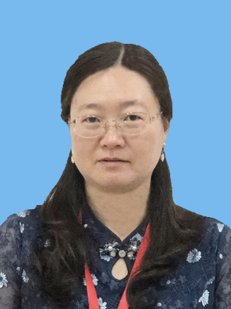

 
 
  <h2> International Conference on Database Systems for Advanced Applications </h2>
 

 
 
  <h2> <a href="https://www.dasfaa2024.org/"> DASFAA 2024 </a><a href="https://www.dasfaa2024.org/">(https://www.dasfaa2024.org/)</a> </h2>
 

 
## Workshop:
**The 11th International Workshop on Big Data Management and Service (02/07/2024, Gifu, Japan)**

## Program

**13:30-13:35 Opening**

**13:35-14:05 Invited Talk: Machine Learning Integrating Cognitive Mechanisms and Knowledge Representation**

 
 

* **Speaker**: Hong Yu (Professor, Chongqing University of Posts and Telecommunications, China)
  
* **Biography**: Hong Yu is a professor at Chongqing University of Posts and Telecommunications in China and an Academic Leader in Intelligent Science & Technology in Chongqing. Her research interests focus on rough sets, three-way decisions, industrial big data, medical data analysis, automation of knowledge, knowledge discovery and machine learning. Her researches have been funded by the National Natural Science Foundation of China. She received a Chongqing Natural Science and Technology Award. She has published 5 books and 80 research articles. She holds 10 patents and has 12 software copyrights.
* **Abstract**: Current limitations in machine learning reliability stem from two critical gaps: (1) the disconnection between micro data and macro knowledge, and (2) the inconsistency between machine learning paradigms and human cognitive processes. Here I present a study of machine learning by integrating cognitive mechanisms and mesoscale knowledge representation. Drawing inspiration from mesoscience principles, we develop mesoscale knowledge representations that bridge micro data and macro knowledge through causal graphs, hierarchical architectures, and enriched feature embeddings. Our approach systematically incorporates core cognitive mechanisms—including perception, memory, and attention—try to create human-aligned machine learning models. Experimental validation demonstrates the study’s effectiveness: mesoscale representations achieve 2.47% improvement in mean values of age accuracy and enable precise facial age synthesis through hierarchical causal learning. In cognitive integration tasks, we show how episodic memory-based class incremental learning maintains 74.85% average accuracy over 9 learning phases on ImageNet-100. The talk further presents practical implementations in autonomous driving, where our cognitive-mesoscale integration framework enhances success rate by 47.5% at unsignalized intersections through leveraging diminishing demonstrations in deep reinforcement learning. These advancements establish a new paradigm for developing trustworthy, biologically-inspired machine intelligence that harmonizes data-driven learning with human-like reasoning.

**14:05-14:20 MSPformer: P100 is All You Need for Efficient Traffic Flow Prediction**
* Yuyang Wang, Ningning Fu, and Shengheng Liu

**14:20-14:35 CF-SSAD: Addressing Low Separability of Clusters in Medical Data**
* Hanyue Liu, Jianhang Yu, Hong Yu, and Guoyin Wang

**14:35-14:50 Intelligent Dispatch System: An E-Government System Based on LLM**
* Shuchun Wu, Xinyu Xie, Yiqiao Wang, Jiayi Liang, and Junyu Niu

**14:50-15:05 SmartTCM: Intelligent System for TCM Heritage Preservation**
* Ming Guan, Wenjing Yue, Chunliang Chen, Xinyu Wang, and Xiaoling Wang

**15:05-15:30 Coffee Break**

## Organizing Team

* Prof. Yan Zhao, University of Electronic Science and Technology of China 
* Prof. Xiaoling Wang, East China Normal University, China 
* Prof. Kai Zheng, University of Electronic Science and Technology of China 

